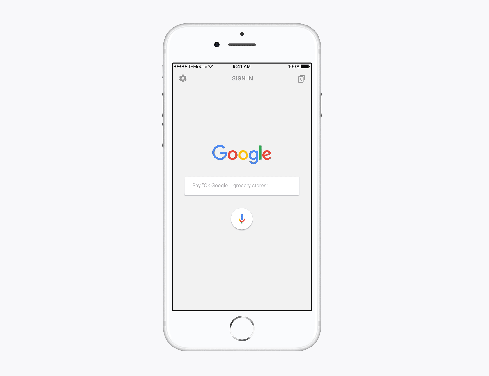
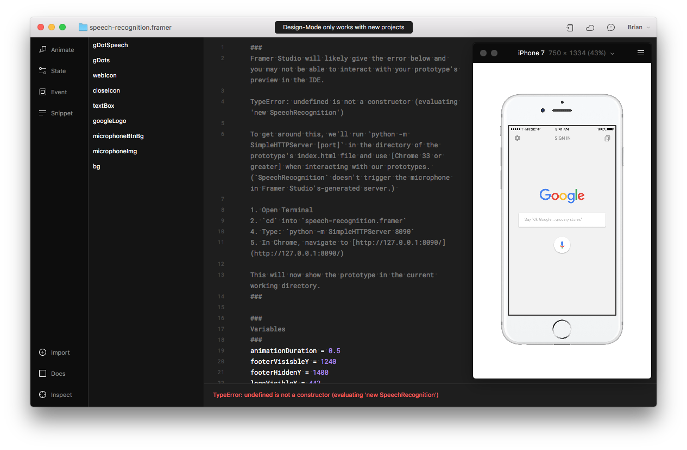
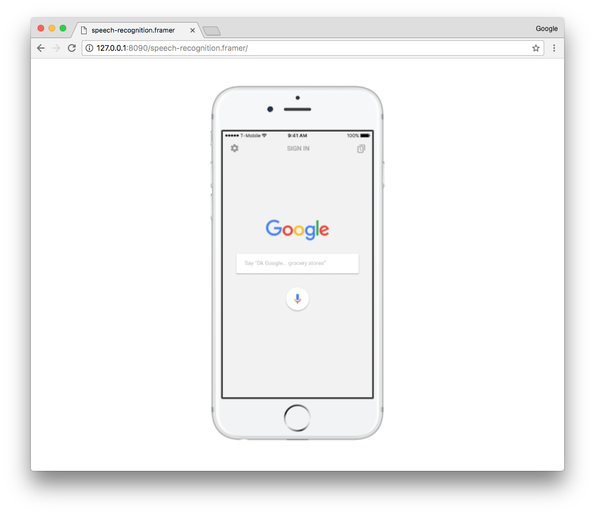

# Web Speech API in Framer.js



### What you’ll learn
* How to connect to the Web Speech API
* How to access your device’s audio input
* How to access your device’s voice synthesizer

### What you’ll need
* The sample code
* Framer Studio (or Framer.js and a text editor)
* Basic knowledge of HTML, CSS, and Javascript (CoffeeScript)
* Chrome >33

The [Web Speech API](https://developer.mozilla.org/en-US/docs/Web/API/Web_Speech_API) provides web apps the ability to recognize voices, transform the audio input into strings, and control the synthesis voices available on the device.

Its two parts, SpeechRecognition (Asynchronous Speech Recognition) and SpeechSynthesis (Text-to-Speech) allow designers to prototype speech-based conversational UIs like [Google Now](https://www.google.com/search/about/learn-more/now/), [Apple's Siri](http://www.apple.com/ios/siri/), and [Amazon Alexa](https://developer.amazon.com/alexa).

The Web Speech API is flagged as an experimental feature in Chrome and Firefox, and is supported in [Chrome Stable 33 and greater](https://developer.mozilla.org/en-US/docs/Web/API/SpeechRecognition#Browser_compatibility).

### SpeechRecognition Prototype
>**tl;dr** This prototype will not function in Framer Studio.

You can [interact](http://share.framerjs.com/jlralchs6vaz/) with the sample prototype of Google's iOS app—using Chrome—or clone this repo. Your browser may request permission to use the microphone.

Framer Studio, the official coding environment of Framer.js, is a Safari browser application, which [doesn't fully support](http://caniuse.com/#feat=speech-recognition) the SpeechRecoginition interface of this experimental API. (Safari supports the SpeechSynthesis interface, however.) Framer Studio will likely give the error below and you may not be able to interact with your prototype's preview in the IDE.

```coffeescript
TypeError: undefined is not a constructor (evaluating 'new SpeechRecognition')
```



To get around this, we'll run `python -m SimpleHTTPServer [port]` in the directory of the prototype's index.html file and use [Chrome 33 or greater](https://developer.mozilla.org/en-US/docs/Web/API/SpeechRecognition#Browser_compatibility) when interacting with our prototypes. (`SpeechRecognition` doesn't trigger the microphone in Framer Studio's-generated server.)

1. Open Terminal
2. `cd` into `speech-recognition.framer`
3. Type: `python -m SimpleHTTPServer 8090`
4. In Chrome, navigate to [http://127.0.0.1:8090/](http://127.0.0.1:8090/)

This will now show the prototype in the current working directory.




### SpeechRecognition Interface

The [SpeechRecognition](https://developer.mozilla.org/en-US/docs/Web/API/Web_Speech_API) interface allows us to recognize speech and respond accordingly. PromptWorks' piece on [Speech Recognition in the Browser](https://www.promptworks.com/blog/speech-recoginition-in-the-browser?utm_source=codropscollective) provided the snippet below as JavaScript, which I converted to CoffeeScript (and then Framer.js) with [js2coffee](http://js2.coffee/).

You can paste this in Framer Studio and open it with Chrome.

Your browser may request permission to use the microphone.

```coffeescript
# This API is currently prefixed in Chrome
SpeechRecognition = window.SpeechRecognition or window.webkitSpeechRecognition

# Create a new recognizer
recognizer = new SpeechRecognition

# Start producing results before the person has finished speaking
recognizer.interimResults = true

# Set the language of the recognizer
recognizer.lang = 'en-US'

# Define a callback to process results
recognizer.onresult = (event) ->
  result = event.results[event.resultIndex]
  if result.isFinal
    print result[0].transcript
  else
    print result[0].transcript
  return

# Start listening...
recognizer.start()
```

Now we can do any number of things with the audio, which is now a string. For example, you can pass the output as HTML to a layer.

```coffeescript
textBox = new Layer
	backgroundColor: "none"
	color: "#969696"
	html: "Speak now"

textBox.style =
	"fontSize" : "50px"
	"fontWeight" : "300"
	"textAlign" : "left"
	"fontFamily": "Arial"

recognizer.onresult = (event) ->
  result = event.results[event.resultIndex]
  if result.isFinal
    textBox.html = result[0].transcript
  else
    textBox.html = result[0].transcript
  return
```

### SpeechSynthesis Interface
The [SpeechSynthesis](https://developer.mozilla.org/en-US/docs/Web/API/SpeechSynthesis) interface provides controls and methods for the synthesis voices available on the device. [Browser compatibility](https://developer.mozilla.org/en-US/docs/Web/API/SpeechSynthesis#Browser_compatibility) is better with this interface, with support both in Safari and on several mobile browsers.

Snippets from [PromptWorks](https://www.promptworks.com/blog/speech-recoginition-in-the-browser?utm_source=codropscollective).

```coffeescript
speechSynthesis.speak new SpeechSynthesisUtterance('Hello world.')
```

Incrementing `utterance.voice = voices[1]` should allow you to cycle through your device's synthesis voices.

```coffeescript
voices = speechSynthesis.getVoices()
utterance = new SpeechSynthesisUtterance('Hello world.')
utterance.voice = voices[1]
speechSynthesis.speak utterance
```


### References
* PromptWorks - [Speech Recognition in the Browser](https://www.promptworks.com/blog/speech-recoginition-in-the-browser?utm_source=codropscollective)
* MDN - [Web Speech API](https://developer.mozilla.org/en-US/docs/Web/API/Web_Speech_API)
* MDN - [SpeechRecognition Interface](https://developer.mozilla.org/en-US/docs/Web/API/SpeechRecognition)
* MDN - [SpeechSynthesis Interface ](https://developer.mozilla.org/en-US/docs/Web/API/SpeechSynthesis)
* [js2coffee 2.0](http://js2.coffee/)
